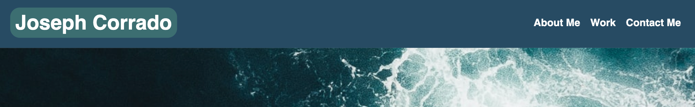
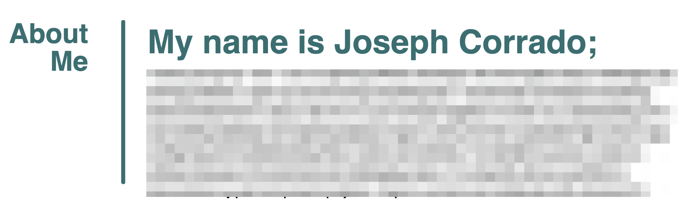
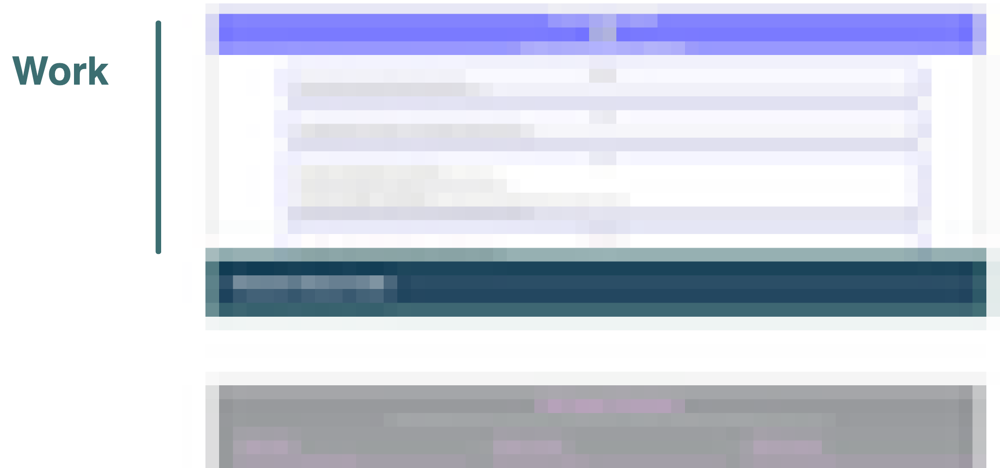
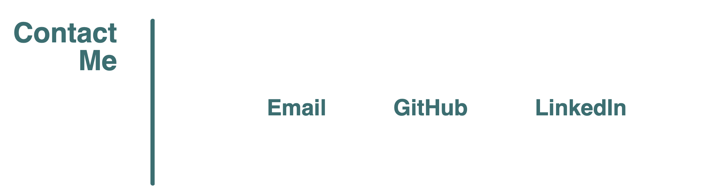
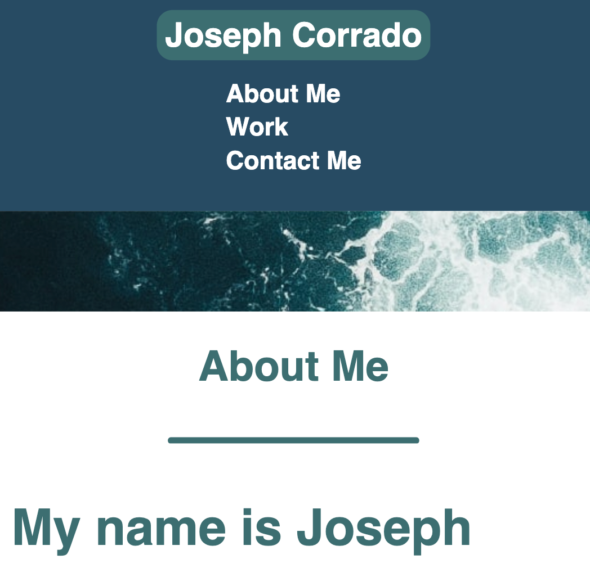

# Portfolio

## My Previous and In Progress Developer Portfolio
---

I wanted to create a portfolio of my previously deployed and upcoming projects to display for potential employers or anyone who is just interested on possibly collaborating on any projects.

Specifically I wanted to meet certain criteria when creating this page:

1. The site needs to be responsive to adapt and accommodate different screen sizes
2. The site needs to provide information to potential employers or collaborators about who I am as a person and a developer
3. Examples of my work needs to be displayed with their respective titles with, my first project being the largest
4. When users select an example of my work, it needs to bring them to the deployed version of said project or a filler page if the project is still upcoming/in development
5. The site needs to have different methods of contacting me for potential employers or collaborators
6. Methods of contact need to link and open in a new tab to whichever method of contact chosen

## Installation
---
N/A

## Usage
---
Use this webpage as a portfolio to learn more about myself, see past, present, and upcoming projects, and/or to get in contact with me for possible employment or collaboration opportunities. 

The top of the page includes my name and a navbar with links to different sections within the page: 

 

The following section includes the about me, works, and contact method links:

 

I also made sure that the page scales for smaller screen options:

## Credits
---
N/A
## License
---
N/A

